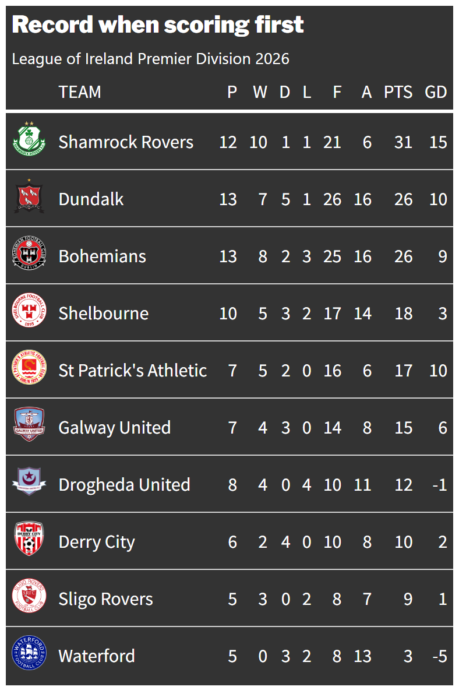

# ⚽ League of Ireland Premier Division 2026: Team-by-team outcomes when scoring first

This data visualisation examines the impact of scoring first, tracking the 96 matches played ahead of the 2026 summer break to isolate how teams fared after breaking the deadlock.

---

## 📈 Analysis and findings

Scoring the first goal in a game is so important.

More often than not, it defines the outcome of a match.

As Rob Eastway and John Haigh mentioned in *The Hidden Mathematics of Sport*, the team that scores first wins about two-thirds of the time, while there is only a one-in-seven chance that a side loses after netting the opening goal.

Trends in Ireland mirror this global reality.

As the 2026 League of Ireland Premier Division campaign pauses for a two-week summer break (matches resume on Friday, June 12), only **Waterford FC**, the team bottom of the table, have failed to win after breaking the deadlock.

Conversely, defending champions **Shamrock Rovers** – winners of five of the last six titles – lead the way with 10 victories from 12 the matches where they claimed the opener.

---

## 📊 Visual composition

### Explanation of plot:
The data charts each team's performance along a chronological match sequence (x-axis) against the exact minute the opening goal was scored (y-axis). 

Situations where the team that scores first wins are represented by a green dot; an orange dot denotes when the side that claims the opening goal is subsequently held to a draw; a red dot signifies a fixture that ended in defeat.

* **Leaders**: Title holders **Shamrock Rovers'** grid is festooned with green – 10 wins from 12.
* **Laggards**: Teams prone to dropping points show clusters of orange and red markers, revealing an inability to see out games even after scoring first. **Waterford** are the worst offenders in this regard: no wins from five. 

## 💻 Tech Stack

- **Language:** R
- **Key Packages:** `gt`, `tidyverse` (`dplyr`, `tibble`, `ggplot2` for data visualisation using `facet_wrap`)

